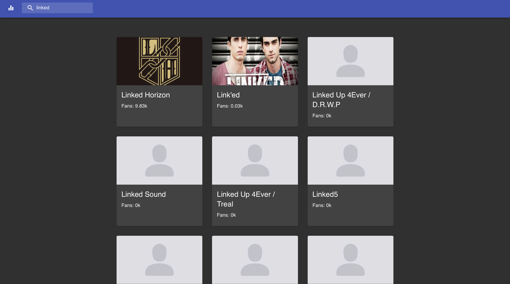
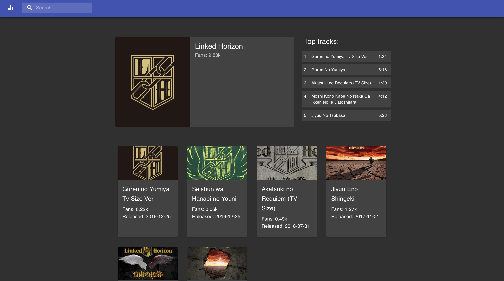

# Technical assessment for full stack developer

## The purpose of the assessment is to test your ability to:

* Build a single page application using HTML and CSS using responsive design
* Use modern JavaScript efficiently
* Integrate with external APIs
* Create your own API/BFF layers

## Please use the following tools as part of your solution:

* ReactJS / Angular
* Typescript
* NodeJS (with Express)

## What is expected?

This assessment requires that you build a react (or angular) application with an express api middle layer to interface with the deezer API on the clients behalf.

### Optional Extras

The following are completely optional, but will count to your advantage if any are included in the application:

* Requests using the modern `fetch` API
* Async / await statements
* Object spreads
* Functional array methods (map, filter, reduce)
* Unit tests (using jest)
* Using @material-ui.
* Usage of styled-components
* React hooks
* Integrate with a MongoDB (optional)

### Search Results

The user should see a list/grid of search results displaying a list of matching results, paging is not required.

Each result should display the following:

* An image relevant to the result
* The Artists name
* Fan count.

`

### Artist details

If a user clicks on one of the artists they should be navigated to a details page displaying the following details:

* An image relevant to the artist.
* The artist with their fan count.
* The artists top 5 most popular tracks
* A list of the artists albums.

## Supporting documentation

The deezer API documentation are available [HERE](https://developers.deezer.com/api)

## What should be part of your solution?

* The solution should be delivered as a collection of source files in a github repository.
* Documentation should be provided in the form of a README file with clear instructions on how to build & run your application.

## How will the technical assessment be evaluated?

* The code will evaluated for clarity, design and readability.

* If any tests are part of the submitted solution, the tests will be run to test the solution. The tests will be evaluated to verify the quality of the tests.

* The solution will be opened in the Chrome browser and the functionality described above will be tested. Both positive and negative tests will be done against the solution.

* Responsive layouts will be simulated using Chrome's developer tools.

## MongoDB Integration (Optional)

If you choose to include MongoDB into your solution the expectation is that it would serve the purpose of a basic caching utility, whereby a users would receive fresh data for an initial search, but all subsequent searches will be retrieved from the MongoDB "cache". You also need to include a lifespan for said cache to ensure that after a certain amount a time, the data is refreshed from the Deezer API.

## How do I submit my solution?

Create a new repository with your assessment submission on GitHub, and send us the link via email.

> Note: Please do not fork this repository
